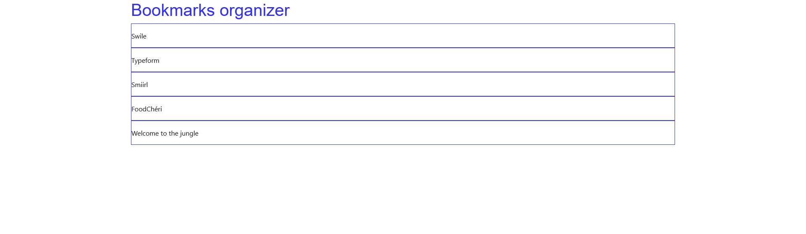

# Bookmarks organizer

This ugly app should be turned into a great UI/UX tool to manage web bookmarks, our company's success is bound to this critical app.

# Getting Started with Create React App

This project was bootstrapped with [Create React App](https://github.com/facebook/create-react-app).
Use `yarn install` and `yarn start` to get started.

# Task 1

Style the cards to be as cool as you can, then style the list and the headings. Write reusable and readable code.
Don't reinvent the wheel.
Keep in mind that the page must be responsive.

# Task 2

Now that it's cool, add some features, like list shuffle and item delete.

# Task 3

Duplicate the list so that the page shows bookmarks that I like on one side, and bookmarks that I don't like on the other side.
Do the magic stuff now: let users move items between the two lists using some cool drag & drop feature.

# Hints

There is no "right answer" here, you are free to make design and architectural choices, feel free to use comments to explain that and to let other teammates understand the benefits.

Take your time to organize the code.

Whether or not you already know one way to solve a task, take some time to evaluate other options available, and share your thoughts about them.
